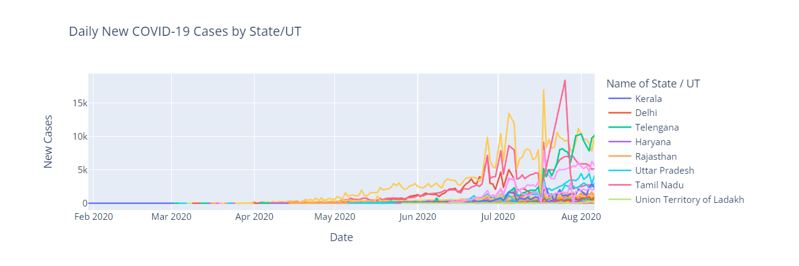
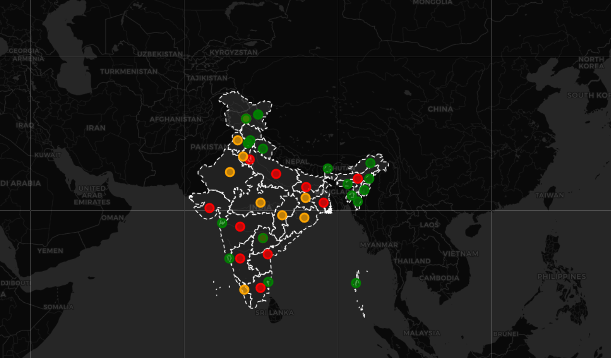

# Interactive COVID-19 Trends Analysis by State/UT

This project provides an interactive analysis of COVID-19 trends across various states and union territories (UTs) in India. It includes geospatial maps and time series analysis for tracking the trends in total confirmed cases, deaths, and recoveries over time, with interactive features to compare specific states or view all states simultaneously.

## Table of Contents

- [Introduction](#introduction)
- [Data Sources](#data-sources)
- [Features](#features)
- [Setup and Installation](#setup-and-installation)
- [Usage](#usage)
- [Visualizations](#visualizations)
- [Known Issues](#known-issues)
- [Future Work](#future-work)
- [Contributing](#contributing)
- [License](#license)
- [Acknowledgements](#acknowledgements)
- [Contact Information](#contact-information)

## Introduction

The goal of this project is to provide a dynamic and interactive way to explore COVID-19 data for different states in India. The visualizations are created using Plotly and Folium to enable users to analyze trends over time and compare metrics such as total confirmed cases, deaths, and recoveries.

## Data Sources

- **COVID-19 Data**: The data used in this project is sourced from a CSV file that contains daily reports of COVID-19 cases for various states in India. The data includes columns for state names, dates, latitude, longitude, total confirmed cases, deaths, and recoveries.
- **GeoJSON Data**: The geographical boundaries for Indian states are obtained from [Carto's public API](https://un-mapped.carto.com).

## Features

- **Interactive Line Charts**: Track the trends of COVID-19 metrics (confirmed cases, deaths, recoveries) over time for each state.
- **Dropdown Menu**: Select specific states to view individual trends or compare all states simultaneously.
- **Folium Map**: Visualize the COVID-19 data on an interactive map with markers indicating different metrics.
- **Dynamic and Customizable**: Update the data and visualizations easily to reflect the latest available information.

## Setup and Installation

### Prerequisites

- Python 3.x
- pip (Python package installer)

### Installation

1. Clone the repository:

   ```python
   git clone https://github.com/yourusername/covid19-interactive-analysis.git
   ```
2. Navigate to the project directory:

    ```python
    cd covid19-interactive-analysis
    ```
3. Install the required packages:

    ```bash
    pip install -r requirements.txt
    ```
## Usage
1. Ensure your COVID-19 data CSV file is in the correct format and placed in the project directory. The file should include the following columns:

- Name of State / UT
- Date
- Latitude
- Longitude
- Total Confirmed cases
- Death
- Cured/Discharged/Migrated

2. Run the Jupyter notebook or script to generate the visualizations.

    ```python
    jupyter notebook Covid-19.ipynb
    ```

3. Follow the instructions in the notebook to create interactive line charts and a Folium map.

### Line Chart

### Geospatial Map


## Visualizations
### Line Charts
- Trends of Total Confirmed COVID-19 Cases by State/UT
- Trends of Total COVID-19 Deaths by State/UT
- Trends of Total Recovered COVID-19 Cases by State/UT

### Geospatial Map
- Interactive map with markers for Total Confirmed Cases, Daily New Cases, Total Deaths, and Total Recovered Cases.

## Known Issues
- Inconsistent state names between datasets may cause mismatches in visualizations.
- Limited to the data available in the provided CSV file.
## Future Work
- Integrate real-time data updates using APIs.
- Add more metrics such as testing rates and hospitalizations.
- Enhance visualizations with additional interactive features.
- Improve data preprocessing and validation.
## Contributing
Contributions are welcome! Please read the [contributing](#contributing) guidelines for more information.

## License
This project is licensed under the MIT License - see the [LICENSE](#license) file for details.

## Acknowledgements
- Data Source: [Carto](https://un-mapped.carto.com)
- Python Libraries: Plotly, Folium, Pandas
- Inspiration: The need for accessible and interactive data analysis tools during the COVID-19 pandemic.

## Contact Information
For further questions or contributions, please contact:

Email: [ojhasanskriti08.09@gmail.com](mailto:ojhasanskriti08.09@gmail.com)